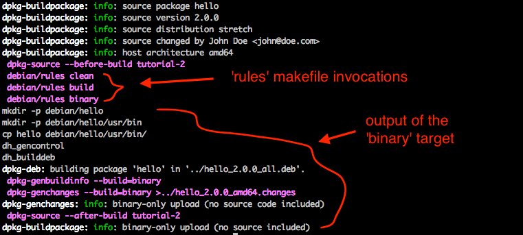

# Tutorial 2: building a binary package using dpkg-buildpackage

Building a Debian package properly involves many different tools and concepts that build on top of each other. You have already been introduced to the lowest-level tool -- `dpkg-deb` -- in tutorial 1. In this tutorial we will teach you how to use a higher-level tool called `dpkg-buildpackage`, which uses dpkg-deb under the hood.

The way we teach dpkg-buildpackage in this tutorial is not entirely the proper way to use it, but it's the easiest to learn. In later tutorials we teach more proper ways.

**Table of contents**

 * Why dpkg-buildpackage?
 * The dpkg-buildpackage workflow
 * Preparing the application
 * Creating the `debian/` subdirectory
   - `debian/control`
   - `debian/changelog`
   - `debian/compat`
   - `debian/rules`
 * Building the package
 * Verifying that it works
 * Conclusion

---

## Why dpkg-buildpackage?

Debian has some pretty detailed rules on what a "proper" Debian package looks like. These rules are specified in the [Debian Policy Manual](https://www.debian.org/doc/debian-policy/). All packages submitted to Debian's (and Ubuntu's) repositories must adhere to these rules. For example:

 * all packages are expected to contain basic documentation (even documentation on the packaging itself) in /usr/share/doc.
 * they are expected to be signed with digital signatures; they are expected to conform to the [Filesystem Hierarchy Standard](https://www.debian.org/doc/debian-policy/ch-opersys.html#s9.1).
 * they are expected to include Systemd service units where applicable.
 * they are expected to exclude debugging information from all C/C++ binaries.
 * RubyGems and NPM modules are expected to live in very specific directories

...etcetera.

dpkg-buildpackage helps you conform to these rules by allowing you to do certain things automatically in a manner that conforms to the rules. In return, it enforces a specific workflow and a specific structure for your package specification files. This workflow and these structures take a while to learn compared to just using dpkg-deb.

If you're just packaging your own app, with no intention to submit your packages to the Debian/Ubuntu repositories, then you may wonder why you should care about dpkg-buildpackage instead of continuing to use dpkg-deb. The answer is tooling: pretty much all Debian packaging tools expect you to follow the dpkg-buildpackage workflow/structure. There are tools that check for common problems in packages; tools that help you build packages for multiple distributions and architectures from a single computer; tools that help you sign packages; and much more.

## The dpkg-buildpackage workflow

Let's say we have a hello world Python application named "hello". It prints "hello 2" and we want it to be installed to /usr/bin.

dpkg-buildpackage requires you to specify:

 * Basic package metadata such as name, dependencies, description.
 * A changelog of how your package has evolved over time.
 * How your application should be compiled from source.
 * How the package file listing should be created from the application's source directory and compiled products.

These specifications are stored in text files inside a directory named `debian`. This directory is expected to live inside the application's source directory. So the structure you end up with looks as follows:

    hello
    ...and other application source files...
    debian/
        control
        changelog
        compat
        rules
        ...and other specification files...

Then you invoke dpkg-buildpackage (`dpkg-buildpackage -b`) from the application's source directory. Dpkg-buildpackage compiles the application using your instructions. It also creates the package root directory (under `debian/<source package name>`) and create files in there based on your instructions on how that should be done. At this point you end up with a structure like so:

    hello
    ...and other application source files...
    debian/
        control
        changelog
        compat
        rules
        ...and other specification files...

        hello/   <--- this is the package root
            DEBIAN/
                control
                ...and other metadata files...
            usr/
                bin/
                    hello

Finally, it performs a bunch more postprocessing and runs dpkg-deb to create the .deb file in the *parent* directory:

    ../hello_2.0.0_all.deb

Now that you understand the workflow, let's make a package.

## Preparing the application

Create a directory for this tutorial. Inside the directory we place a simple hello world application, but we call this version 2.

~~~bash
mkdir tutorial-2
cd tutorial-2
editor hello.py
chmod +x hello.py
~~~

`hello` should contain:

~~~python
#!/usr/bin/env python
print("hello 2")
~~~

## Creating the `debian/` subdirectory

Dpkg-buildpackage expects a package specification under a subdirectory named `debian/`. This directory must contain at minimum the following files:

 * `control` -- contains basic package metadata. It is similar to the one in tutorial 1, yet there are differences.
 * `changelog` -- contains a changelog of how the package has evolved over time. This is not just any plain text file -- it must conform to [a specific format](https://www.debian.org/doc/debian-policy/ch-source.html#s-dpkgchangelog) that specifies a list of changelog entries and version numbers. Counterintuitively, dpkg-buildpackage infers the package version number from this file, and *not* from a "Version" field in `control`!
 * `compat` -- specifies the minimum version of debhelper that your package needs. This probably means nothing to you right now, but that's fine, we'll get to this in tutorial 3. For now just understand that it must contain the magic number "9".
 * `rules` -- a file, in `Makefile` format, that specifies how your application must be compiled and how the package root directory should be created.

There are also other possible files, but we'll get to them in later tutorials.

### `debian/control`

Put this in the control file:

~~~
Source: hello
Section: devel
Priority: optional
Maintainer: John Doe <john@doe.com>

Package: hello
Architecture: all
Depends: python
Description: John's hello package
 John's package is written in Python
 and prints a greeting.
 .
 It is awesome.
~~~

Note the differences from tutorial 1:

 * A new section had been added at the beginning of the file. This section is called the *source section*, while the section at the end is called the *package section*.
 * A "Section" field has been added. It specifies which category this package falls in. In our case, we specify "devel" as in "developer tools". See [the Debian Policy Manual](https://www.debian.org/doc/debian-policy/ch-archive.html#s-subsections) for a listing of section names.
 * A "Priority" field has been added. It specifies which [how important](https://www.debian.org/doc/debian-policy/ch-archive.html#s-priorities) this package is.
 * The "Version" field is gone. As explained above, dpkg-buildpackage infers the version number from the changelog file.
 * The "Maintainer" field has been moved from the package section to the source section.

The "Source" field specifies the name of the source package, which may be distinct from the name of the binary package. A source package is a special kind of Debian package that does not contain binaries, but source code and packaging specification files, allowing anybody to build a binary package in a fully reproducible manner. Source packages will be covered in a later tutorial. For now, let's give the source package and the binary package the same name: "hello".

### `debian/changelog`

Put this in the changelog file:

~~~
hello (2.0.0) stretch; urgency=medium

  * Initial packaging work with dpkg-buildpackage.

 -- John Doe <john@doe.com>  Thu, 06 Jul 2017 09:19:24 +0000
~~~

The changelog file conform to [a specific format](https://www.debian.org/doc/debian-policy/ch-source.html#s-dpkgchangelog) and contains a list of changelog entries. In this case, the changelog file only contains one such entry. The first line of the entry must be in the format of:

    <source package name> (<version number>) <distribution name>; urgency=<urgency>

The middle of the entry must contain one or more bullet points that explain what has changed in this package version.

The last line specifies who made these changes, and must be in the format of:

     -- <name> <<email address>>  <date in RFC 2822 format>

Note that the file is extremely sensitive to spaces. For example there must be a space before the `--`, and there must be **two** spaces between the email address and the date.

Tip: you can obtain the current date in RFC 2822 format by running:

    date -R

### `debian/compat`

We'll explain this file in tutorial 3. For now just understand that it must contain the magic number "9".

~~~bash
echo 9 > debian/compat
~~~

### `debian/rules`

The rules file is a Makefile. Dpkg-buildpackage expects this file to contain three targets (and invokes them in this order):

 * `clean` -- remove all compilation products.
 * `build` -- compile the application.
 * `binary` -- create a package root directory. This directory is expected to have the filename `debian/<source package name>`, so in this case `debian/hello`.

All of these targets are invoked from the application source directory, as described in section [The dpkg-buildpackage workflow](#the-dpkg-buildpackage-workflow).

Put this in the rules file:

~~~Makefile
#!/usr/bin/make -f

clean:
	@# Do nothing

build:
	@# Do nothing

binary:
	mkdir -p debian/hello
	mkdir -p debian/hello/usr/bin
	cp hello debian/hello/usr/bin/
	dh_gencontrol
	dh_builddeb
~~~

Since `hello` is a Python application, there are no `clean` and `build` steps.

The `binary` step begins with a bunch of commands that create the package root directory and that populate it with files.

The `binary` step then ends with some boilerplate commands:

 * `dh_gencontrol` is a debhelper command which creates a `DEBIAN/control` file inside a package root directory. It takes the `debian/control` file that we wrote, performs some postprocessing (performs substitutions and adds some more fields) and writes the result to `debian/hello/DEBIAN/control`. For example, it automatically infers the size of the `debian/hello` directory and adds the "Installed-Size" field for you.
 * `dh_builddeb` is a debhelper command which invokes dpkg-deb to create the .deb file from the package root directory.

You will learn more about debhelper in tutorial 3.

## Building the package

Now you are ready to build the package:

~~~bash
dpkg-buildpackage -b
~~~

The `-b` flag tells dpkg-buildpackage to build a binary package.

As you can see from dpkg-buildpackage's output, it runs the 'rules' makefile's three targets:

## Verifying that it works

When done, you will end up with a .deb file in the *parent* directory. Install it and verify that it works:

~~~bash
$ sudo apt install -y ../hello_2.0.0_all.deb
$ hello
hello 2
~~~

## Conclusion

Congratulations, you have learned how to use the dpkg-buildpackage workflow and structure to build a binary package! However this only concludes the beginning of your journey. We taught you how to use dpkg-buildpackage to build a binary package directly, but the proper way of Debian package building involves orig tarballs, source packages and debhelper. Furthermore, we've only packaged Python applications so far, which do not require compilation. Packaging compiled applications is a bit more involved.

We'll explain orig tarballs and source packages in later tutorials. In the next tutorial, let's have a look at how we can package a C application, and what debhelper is. You will learn what the mysterious `debian/compat` file is and what the `dh_*` boilerplate commands do.
